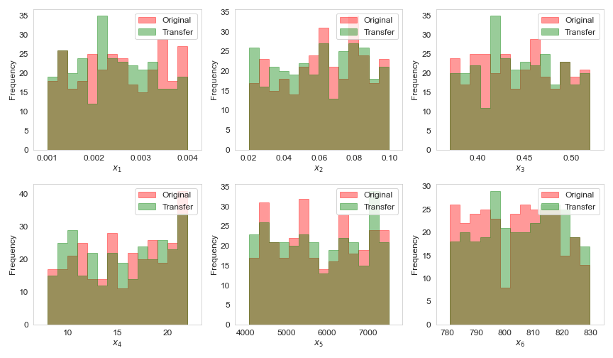

# x-rnn for simulated data (fixed control)

RNN-autoencoder forecasting model for unconventional wells that takes in formation/completion properties and past production data, both as input to forecast future production. This demo `demo-xrnn-transfer-learning.ipynb` uses synthetic data simulated based on properties of the Bakken Shale Play. We use a transfer learning approach to train the predictive model using simulated data of unconventional reservoirs from *different* localities, i.e. simulated data (comprising of well formation and completion properties, as input **x** and the corresponding observed production, as output **d**) can be used to pre-train the predictive model to improve the generalization capability.

As an example, the map from EIA above shows three different regions of production marked with stippled circles. Ideally, with enough data from each producing region we can construct a predictive model to approximate function **g**. Suppose we want to explore a new region (the third circle at the bottom of the figure), when data is insufficient, we can borrow some information from other producing regions as analogues. As more local data becomes available, the predictive model can be continously updated to adapt to the local production behavior.

## Dataset

We split the multivariate timeseries (i.e. three channels of oil, water and gas profiles) into chunks of input-output window to frame the problem as a supervised machine learning problem. We want to predict a multi-channel time window **y_w+1** of length `n_seq` using the past information window **y_w** of length `n_lag` and the formation/completion input properties **x**. We want to learn **f**, which is a time-invariant predictive model that relates **y_w** and **x** to **y_w+1**.

In this example, we use two synthetic datasets generated from the same distribution, using the same forward model **g** and call them the *train* and *transfer* dataset respectively. Naturally, the histograms of the input properties **x** show that the ranges of each parameter are relevant.

The timeseries of simulated production responses **d** show that the ranges are also relevant. We first train the predictive model using data from the *train* dataset and proceed test the model on the *transfer* dataset. In practice, these two datasets may show very different distributions, that will necessitate retraining the predictive model on some of the *transfer* dataset, but in this demo the goal is to illustrate the methodology. 

The PCA coefficients of both **x** and **d** show that the *train* and *transfer* datasets are relevant.

## Model architecture

The RNN-autoencoder forecast model neural network architecture consists of an LSTM encoder that extracts salient temporal information and a regressor (composed of fully connected dense layers) to extract key information from the formation/completion properties into a feature space. The temporal information is then concatenated with the information from the formation/completion properties and the concatenated vector is fed into an LSTM decoder that will generate the future timesteps.  

The exact input/output dimensions of the RNN-autoencoder forecast model is given below, with a total of 27,323 trainable parameters:

## Results

The scatter plots are color-coded consistent with the line plots. The figure below shows the original timeseries as scatter points, for a single well. The training and testing data points (i.e. **y_w+1** only) are shown as red and blue scatter points respectively. The red and blue lines are the forecasts from the RNN-autoencoder forecast model. The green line represents the multi-step prediction, where previous forecast are fed into the RNN-autoencoder model in a recursive way. 

The plots below show the forecast for a *transfer* well, completely unseen to the model. The only input given to the model are the first three months of production (colored scatter points) and the formation/completion properties that are typically obtained once the well is drilled. The colored lines represent the multi-step forecast for each phase and the semi-transparent gray-colored scatter points are the true reference production points. 

We measure the performance of the predictive model using the entire *transfer* dataset. The first scatter plot shows that the multi-step forecast for each phase is reliable and statistically accurate when measured, RMSE-wise against the true reference production points.

The second bar plot shows the error increase for the multi-step forecast for each timestep - in other words, the farther into the future you predict, the higher is the error. The third histogram shows the error for the wells in the *transfer* dataset - note that the error from the synthetic noise introduced in the dataset is ~0.025.
